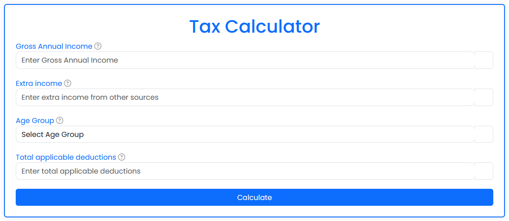
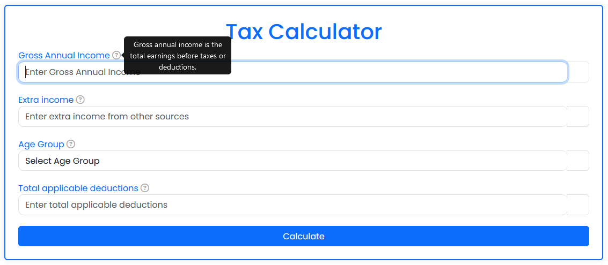
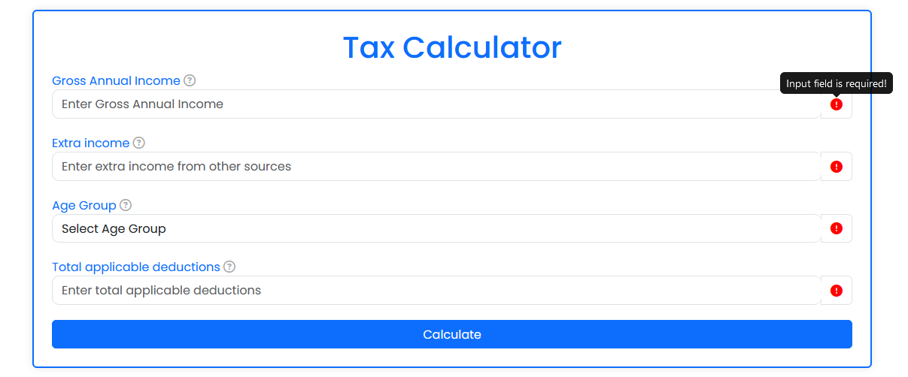
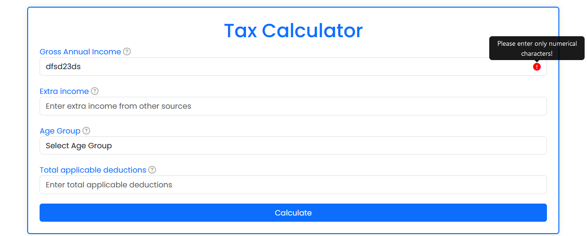
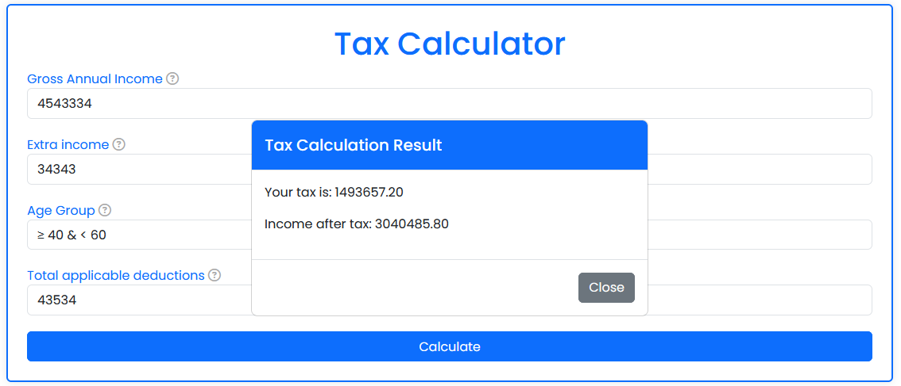

# Tax Calculator Tool

## Overview

This project is a simple web application designed to help users calculate their taxes easily. It aims to simplify the process of tax calculation for individuals or businesses.

## Features

- Calculate taxes based on gross annual income, extra income, age group, and total applicable deductions.
- User-friendly interface with tooltips for additional information.
- Responsive design for optimal viewing on various devices.

## Getting Started

### Prerequisites

- A modern web browser (e.g., Chrome, Firefox, Safari)

### Installation

1. Clone the repository:
git clone https://github.com/Somye55/taxCalculator.git

2. Navigate to the project directory:
cd taxCalculator

3. Open the `index.html` file in your web browser.

## Usage

1. Enter your gross annual income, extra income, age group, and total applicable deductions in the provided fields.
2. Click the "Calculate" button to get your tax calculation result.
3. The result will be displayed in a modal window.

## Screenshots

## Contributing

Contributions are welcome! Please read the [contributing guidelines](CONTRIBUTING.md) before getting started.

## License

This project is licensed under the MIT License - see the [LICENSE](LICENSE) file for details.

## Contact

Email - somyeverma@gmail.com

Project Link: https://tax-calculator-somye.vercel.app/

